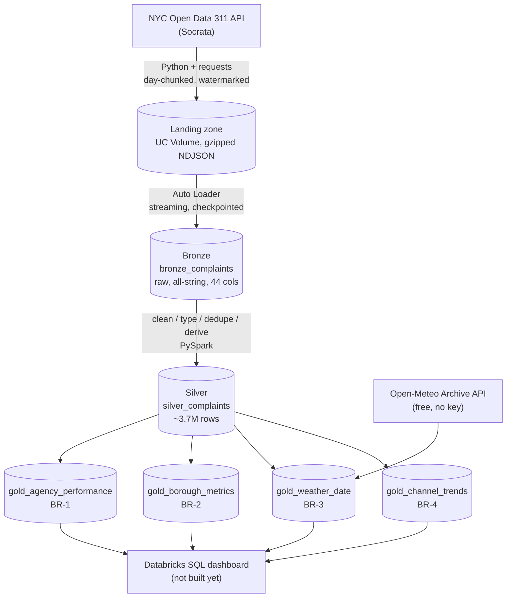

# NYC 311 Pipeline

An end-to-end data engineering pipeline on **Databricks Free Edition** (serverless compute),
built around NYC's 311 service request data. PySpark, Delta Lake, and a medallion
architecture, driven by six concrete business requirements rather than a generic ETL demo.

- **[Architecture](#architecture)**
- **[Business requirements](#business-requirements)**
- **[Data dictionary](#data-dictionary-gold-layer)** (gold layer)
- **[Known data-quality findings](#known-data-quality-findings)**
- **[Key engineering decisions](#key-engineering-decisions)**
- **[Repo layout](#repo-layout)**
- **[Running it](#running-it)**

## Architecture



Medallion layers are table prefixes (`bronze_`, `silver_`, `gold_`) in one schema
(`nyc311.pipeline`), not schema-per-layer — a deliberate simplification for a solo project.

## Business requirements

| ID | Requirement | Status |
|---|---|---|
| BR-1 | Agency response performance — median + p90 resolution time per agency & complaint type, monthly. Open complaints tracked separately, never dropped. | ✅ `gold_agency_performance` |
| BR-2 | Borough equity — comparable resolution times per borough; missing/'Unspecified' borough counted, not dropped. | ✅ `gold_borough_metrics` |
| BR-3 | Heating season readiness — daily HEAT/HOT WATER volume joined with temperature, ≥1 full winter. | ✅ `gold_weather_date` |
| BR-4 | Channel shift — volume by intake channel over time. | ✅ `gold_channel_trends` |
| BR-5 | Data trust — zero duplicate complaints, resolution times bounded, visible freshness. Pipeline fails loudly. | ✅ `quality_checks` |
| BR-6 | Self-service — gold usable by a SQL-literate analyst with no raw-data knowledge. | ✅ this README + table/column comments on all gold tables |

## Data dictionary (gold layer)

### `gold_agency_performance`
Grain: `(agency, complaint_type, month)` for closed-complaint stats; `(agency, complaint_type)`
for the open-complaint snapshot, broadcast identically across every month row for that pair.

| Column | Type | Meaning |
|---|---|---|
| `agency` | string | NYC agency code (e.g. `HPD`, `DOT`) |
| `complaint_type` | string | Complaint category |
| `month` | timestamp | Resolution month (`closed_at` truncated to month); `null` for agency/type pairs with no closed complaints yet |
| `closed_count` | long | Complaints closed that month for that agency/type; `0` if none (not `null`) |
| `median_response_time_hours` | decimal(10,2) | Median created→closed hours, that month |
| `p90_response_hours` | decimal(10,2) | 90th-percentile resolution hours, that month |
| `open_count` | long | Currently-open complaints for that agency/type (a snapshot, not month-scoped) |
| `median_open_age_hours` | decimal | Median hours-open for those currently-open complaints |

### `gold_borough_metrics`
Grain: `(borough, complaint_type)`. No month dimension — BR-2 is framed as a full-period
equity comparison, not a monthly trend.

| Column | Type | Meaning |
|---|---|---|
| `borough` | string, nullable | Can be `null`/`Unspecified` — kept per BR-2, never dropped |
| `complaint_type` | string, nullable | Occasionally `null` in source data |
| `closed_count` / `open_count` | long | Same semantics as above |
| `median_response_time_hours` / `p90_response_hours` | decimal | Same semantics as above |
| `median_open_age_hours` | decimal | Same semantics as above |

### `gold_channel_trends`
Grain: `(intake_channel, month)`. `month` here is **creation** month (`created_at`), not
resolution month — BR-4 is about intake volume, not resolution speed.

| Column | Type | Meaning |
|---|---|---|
| `intake_channel` | string, nullable | `Mobile` / `Phone` / `Online` / `Other` / `null` |
| `month` | timestamp | Creation month |
| `complaint_count` | long | Complaints filed that month via that channel |

### `gold_weather_date`
Grain: `(date)`, one row per calendar day in the backfill window — including days with zero
HEAT/HOT WATER complaints, since BR-3 is a temperature/volume correlation that needs the mild
days as much as the cold ones.

| Column | Type | Meaning |
|---|---|---|
| `date` | date | Calendar day (America/New_York) |
| `temperature_2m_max` / `_min` / `_mean` | decimal | Daily NYC temperature, °C (Open-Meteo, Central Park coordinates) |
| `complaint_count` | long | HEAT/HOT WATER complaints created that day; `0` if none |

### `quality_checks` (BR-5)
Append-only audit log — one immutable row per `03_silver` run, not a snapshot table.

| Column | Type | Meaning |
|---|---|---|
| `run_at` | timestamp | When this run's checks were computed |
| `duplicate_count` | long | Duplicate `complaint_id`s found; should always be `0` (dedup guarantees it — the run fails loudly if not) |
| `bounds_violation_count` | long | Rows with an implausible resolution duration (flagged, not dropped, in silver) |
| `latest_ingested_at` | timestamp | Freshness signal — most recent `_ingested_at` in that run's silver data |
| `total_rows` | long | Row count of silver as of that run |

## Known data-quality findings

The raw Socrata feed is messier than it looks. Findings from inspecting a real sample, and how
each is handled:

| Finding | Handling |
|---|---|
| Everything arrives as a string | Typed explicitly in silver (`cast_types`) |
| Inconsistent internal whitespace (`34 NORTH    6 STREET`) | Regex whitespace collapse |
| Fake nulls (`"Unspecified"`, `"N/A"`, `""`) | Normalized to real `null` |
| Inconsistent casing (`BROOKLYN` vs `Brooklyn`) | `upper`/`initcap` normalization |
| Duplicates from at-least-once ingestion | Deduped on `complaint_id`, latest lifecycle state wins |
| Negative / implausibly long resolution durations | Flagged (`_duration_valid`), never silently dropped |
| `status` column is unreliable — rows labeled `Assigned` or `null` are often already closed | Gold builders key off `closed_at IS NULL`/`IS NOT NULL` instead of `status` |
| `DOB, Construction Safety Enforcement`: ~2,110 Oct 2025 complaints resolved in ~18 seconds | Confirmed genuine source-data characteristic (reappeared independently across 4 different boroughs), not a pipeline bug — likely an administrative record type created already-resolved |
| Nested JSON (`location`), composite fields (`community_board`), sparse geo/bridge/taxi columns | Consciously excluded from silver v1 (recoverable from bronze if ever needed) |

## Key engineering decisions

- **Day-chunked ingestion**, ordered by `created_date` rather than the system `:id` column —
  Socrata can't serve `:id`-ordering from an index alongside a date filter, and read-timed out
  at 90s for even 1,000 rows under that ordering. Chunking by day also avoids deep-`$offset`
  pagination, which independently timed out past ~2M rows regardless of ordering.
- **`run_`-prefixed landing filenames** — page numbering restarts at 0 every ingestion run; a
  bare `page_0000.json.gz` would get silently overwritten by the next run into the same day's
  folder, and Auto Loader's checkpoint would never notice the gap.
- **Auto Loader with `availableNow` trigger**, not a plain batch read — the checkpoint tracks
  which files were already ingested, so reruns are safe with no duplicate appends.
- **Window `row_number()` dedup, not `dropDuplicates`** — need a guarantee about *which* row
  survives (the latest lifecycle state), with a deterministic tiebreaker for exact reruns.
- **`DECIMAL(10,2)`, not `float`, for resolution-time columns** — `float` reintroduces base-2
  rounding noise (`1.57 → 1.5700000524520874`) that a plain `round()` doesn't fix.
- **`closed_at IS NULL`/`IS NOT NULL` for open/closed, never the `status` column** — sampling
  found `status` unreliable in the source data (see findings above).
- **Null-safe `<=>` in every `MERGE` condition where a grain column can be `null`** — standard
  `=` treats `null = null` as false, which silently re-inserts those rows as new duplicates on
  every rerun instead of updating them in place.
- **`try`/`except DeltaTable.forName()`, not `spark.catalog.tableExists()`, for existence
  checks** — under Spark Connect/serverless, the client-side catalog cache doesn't reliably
  reflect a table created earlier in the same session. Even `DeltaTable.forName()` alone isn't
  fully eager about validating existence, so the merge itself is wrapped in the `try`, with
  `saveAsTable` as the fallback on any failure — reacting to the real failure point rather than
  trusting either API's existence check.
- **Weather data skips the bronze/silver medallion entirely** — Open-Meteo's daily aggregates
  aren't row-paginated like Socrata, so the whole backfill window is one lightweight request,
  refetched in full on every run (`overwrite`, not `MERGE`) rather than tracked incrementally.
  There's no lifecycle to reconcile, unlike a 311 complaint record.
- **`quality_checks` is append-only, not `MERGE`-based** — each pipeline run is a new,
  immutable log entry, not a snapshot to reconcile against a key.

## Repo layout

```
conf/config.yaml         Single source of truth: catalog, schema, backfill start date
notebooks/                *.py, Databricks source format (orchestration only)
  00_setup.py              Creates catalog/schema/volume
  01_ingest.py              Socrata backfill → landing zone
  02_bronze.py              Auto Loader → bronze_complaints
  03_silver.py              Clean/type/dedupe → silver_complaints + BR-5 quality checks
  04_gold.py                Four independent aggregations → gold_* tables
src/nyc311/                All real logic: pure, importable, testable functions
  api_client.py             Socrata ingestion client
  schema.py                 Bronze schema (44 all-string columns)
  transformations.py        Silver build chain
  aggregations.py           Gold table builders
  weather.py                Open-Meteo client
  quality.py                BR-5 checks
```

## Running it

This is built specifically for **Databricks Free Edition** — notebooks import from `src/` via
a `sys.path` workaround (no installable package), and there's no local Spark session, so the
pipeline can't be run outside Databricks. Import this repo as a Databricks Git folder, run
`00_setup` once, then `01_ingest` → `02_bronze` → `03_silver` → `04_gold` in order. Every step
is idempotent — safe to rerun at any point.
